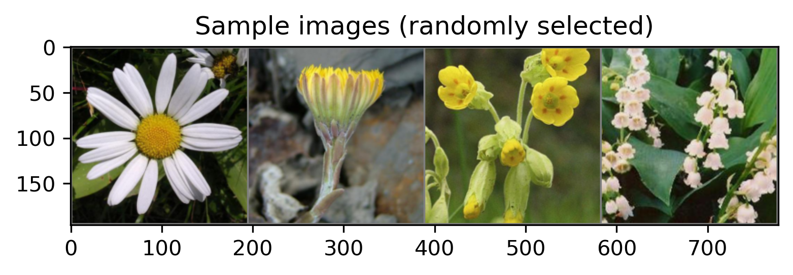
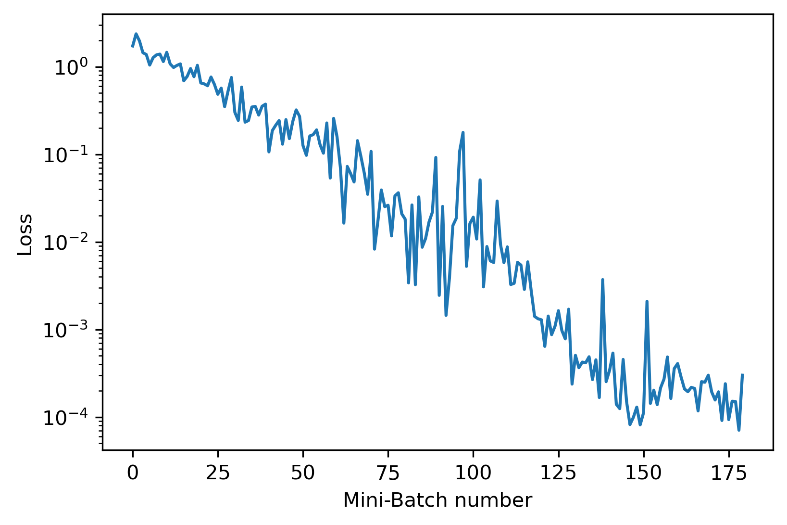

# ML_examples

## 1. Oxford 17 flowers 
[Reference] (https://www.robots.ox.ac.uk/~vgg/data/flowers/17/index.html)

* Images are resized to 192 pixels x 192 pixels.

* Using Pytorch (and torchvision) to construct a convolutional neural net. 

* Different kernel sizes are considered to blend different penalties. 

### ConvNet structure:
4 layers of Conv2D plus two fully connected layer in a sequential order.

>ConvNet(
>  (layer1): Sequential(
>    (0): Conv2d(3, 16, kernel_size=(3, 3), stride=(1, 1), padding=(1, 1))
>    (1): ReLU()
>    (2): Conv2d(16, 32, kernel_size=(5, 5), stride=(1, 1), padding=(1, 1))
>    (3): ReLU()
>    (4): MaxPool2d(kernel_size=2, stride=2, padding=0, dilation=1, ceil_mode=False)
>  )
>  
>  (layer2): Sequential(
>    (0): Conv2d(32, 64, kernel_size=(3, 3), stride=(1, 1), padding=(1, 1))
>    (1): ReLU()
>    (2): Conv2d(64, 64, kernel_size=(5, 5), stride=(1, 1), padding=(1, 1))
>    (3): ReLU()
>    (4): MaxPool2d(kernel_size=2, stride=2, padding=0, dilation=1, ceil_mode=False)
>  )
>  
>  (layer3): Sequential(
>    (0): Conv2d(64, 128, kernel_size=(3, 3), stride=(1, 1), padding=(1, 1))
>    (1): ReLU()
>    (2): MaxPool2d(kernel_size=2, stride=2, padding=0, dilation=1, ceil_mode=False)
>  )
>  (layer4): Sequential(
>    (0): Conv2d(128, 256, kernel_size=(5, 5), stride=(1, 1), padding=(1, 1))
>    (1): ReLU()
>    (2): MaxPool2d(kernel_size=2, stride=2, padding=0, dilation=1, ceil_mode=False)
>  )
>  
>  (classifier): Sequential(
>    (0): Linear(in_features=25600, out_features=512, bias=True)
>    (1): ReLU(inplace=True)
>    (2): Dropout(p=0.5, inplace=False)
>    (3): Linear(in_features=512, out_features=128, bias=True)
>    (4): ReLU(inplace=True)
>    (5): Dropout(p=0.5, inplace=False)
>    (6): Linear(in_features=128, out_features=17, bias=True)
>  )
)

* Both SGD and Adam optimizers are considered, but Adam is easier for tuning given a limited time.

* Hyper parameters are listed below. The dataset has three subgroups for testing, training, and validating (not used). For each testing group, I set an adaptive learning rate and batch number. For a deflating learning rate for each training set, I assume it helps avoid overfitting to some extents. 
- Number of epochs: 10
- Batch size: 50
- Batch inflation rate: 1.2
- Epoch inflation rate: 1.1
- Learning rate (for Adam): 0.00125
- Learning rate (for SGD): 0.02
- Learning rate inflation (deflation when <1): 0.98

* Tested on RTX 3060 Ti with a Ryzen 7 3080 XT processor. Training tales about two minutes.

Six consective runs return an average accuracy around 80% (ranging from 70% to 87%, with different hyperparameters).
- 83.23529411764706 %
- 77.3529411764706 %
- 81.17647058823529 %
- 78.82352941176471 %
- 80.58823529411765 %
- 82.94117647058823 %

To download data, run the shell script first.

